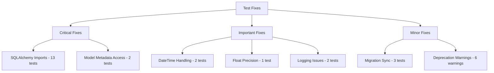
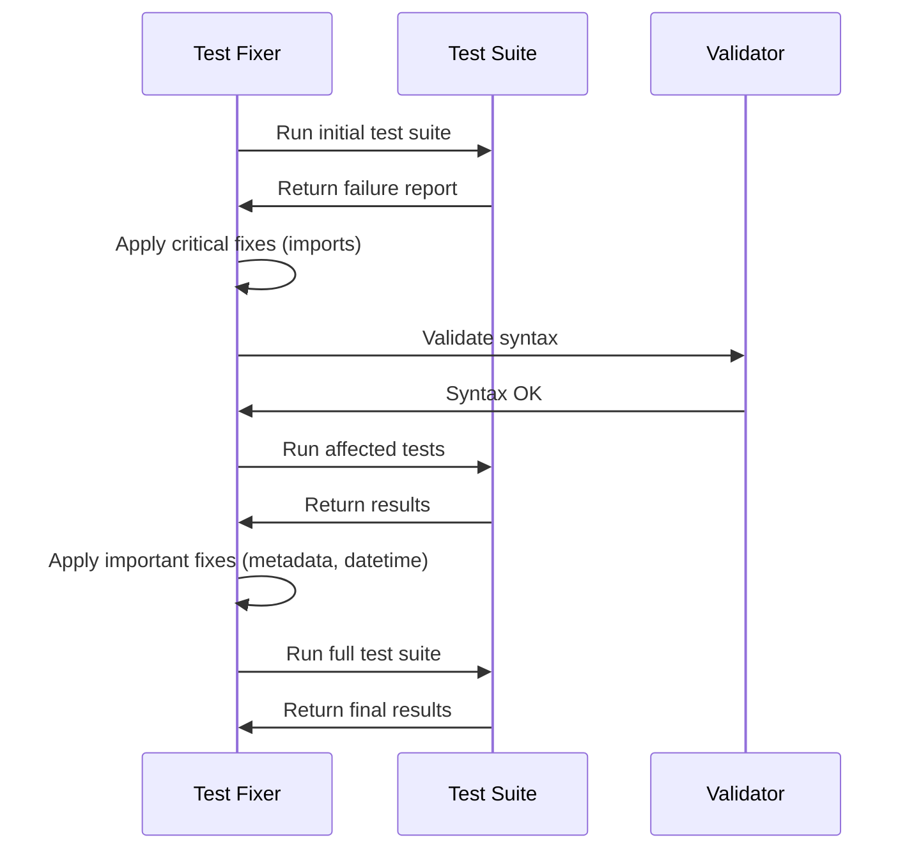

# Design Document: Comprehensive Test Suite Fixes

## Overview

This design document outlines a systematic approach to fixing the 25 failing tests in the Voice AI Agent project. The solution focuses on addressing technical issues while maintaining test integrity and coverage. The approach prioritizes high-impact fixes that resolve multiple test failures simultaneously.

## Architecture

### Fix Categories and Priority



### Solution Strategy

1. **Batch Processing**: Group similar fixes to maximize efficiency
2. **Dependency Resolution**: Fix import issues first as they block other tests
3. **Validation**: Test each fix category independently
4. **Rollback Safety**: Maintain ability to revert changes if needed

## Components and Interfaces

### 1. Import Resolution Component

**Purpose**: Systematically add missing SQLAlchemy imports across test files

**Interface**:
```python
class ImportFixer:
    def scan_missing_imports(self, file_path: str) -> List[str]
    def add_imports(self, file_path: str, imports: List[str]) -> bool
    def validate_imports(self, file_path: str) -> bool
```

**Implementation Strategy**:
- Scan test files for SQLAlchemy usage patterns
- Identify missing imports (primarily `text` from sqlalchemy)
- Add imports in consistent order and format
- Validate syntax after changes

### 2. Model Access Corrector

**Purpose**: Fix incorrect model metadata access patterns

**Interface**:
```python
class ModelAccessFixer:
    def find_metadata_access_patterns(self, file_path: str) -> List[AccessPattern]
    def fix_metadata_access(self, file_path: str, pattern: AccessPattern) -> bool
    def validate_model_access(self, file_path: str) -> bool
```

**Implementation Strategy**:
- Identify `event.metadata["field"]` patterns that should be `event.event_metadata["field"]`
- Replace incorrect attribute access with correct model field access
- Ensure compatibility with SQLAlchemy model definitions

### 3. DateTime Normalizer

**Purpose**: Standardize datetime handling across tests

**Interface**:
```python
class DateTimeNormalizer:
    def normalize_datetime_comparisons(self, file_path: str) -> bool
    def add_timezone_awareness(self, datetime_obj: Any) -> datetime
    def create_comparison_helper(self) -> str
```

**Implementation Strategy**:
- Replace direct datetime equality with timezone-aware comparisons
- Add helper functions for datetime comparison in tests
- Ensure consistent UTC usage across all datetime operations

### 4. Precision Handler

**Purpose**: Handle floating point precision in numerical comparisons

**Interface**:
```python
class PrecisionHandler:
    def find_float_comparisons(self, file_path: str) -> List[Comparison]
    def replace_with_approx(self, file_path: str, comparison: Comparison) -> bool
    def set_precision_tolerance(self, tolerance: float) -> None
```

**Implementation Strategy**:
- Identify direct float equality comparisons
- Replace with `pytest.approx()` calls
- Set appropriate tolerance levels for different types of calculations

## Data Models

### Fix Result Tracking

```python
@dataclass
class FixResult:
    file_path: str
    fix_type: str
    success: bool
    tests_affected: List[str]
    error_message: Optional[str] = None
    
@dataclass
class TestFixSession:
    session_id: str
    start_time: datetime
    fixes_applied: List[FixResult]
    tests_before: TestResults
    tests_after: TestResults
    success_rate_improvement: float
```

### Error Pattern Definitions

```python
class ErrorPattern:
    pattern_id: str
    regex_pattern: str
    fix_template: str
    affected_files: List[str]
    priority: int
```

## Error Handling

### Fix Validation Strategy

1. **Pre-fix Validation**:
   - Backup original files
   - Run syntax validation
   - Identify all affected test cases

2. **Post-fix Validation**:
   - Run syntax check on modified files
   - Execute affected tests in isolation
   - Verify no new failures introduced

3. **Rollback Mechanism**:
   - Maintain file backups for each fix
   - Provide rollback capability for failed fixes
   - Log all changes for audit trail

### Error Recovery

```python
class FixErrorHandler:
    def handle_syntax_error(self, file_path: str, error: SyntaxError) -> bool
    def handle_import_error(self, file_path: str, error: ImportError) -> bool
    def rollback_fix(self, fix_result: FixResult) -> bool
    def validate_test_execution(self, test_files: List[str]) -> TestResults
```

## Testing Strategy

### Fix Validation Process

1. **Unit Testing**: Test each fix component independently
2. **Integration Testing**: Verify fixes work together
3. **Regression Testing**: Ensure no existing functionality breaks
4. **Performance Testing**: Verify test execution time doesn't degrade

### Test Execution Phases



### Success Metrics

- **Primary**: Reduce failing tests from 25 to 0
- **Secondary**: Maintain 438 total tests passing
- **Tertiary**: Eliminate all deprecation warnings
- **Quality**: No reduction in test coverage or effectiveness

## Implementation Plan

### Phase 1: Critical Fixes (High Impact)
1. **SQLAlchemy Import Resolution** (13 tests)
   - Add missing `text` imports to database test files
   - Validate import syntax and functionality
   - Expected impact: 52% of failing tests resolved

2. **Model Metadata Access Correction** (2 tests)
   - Fix `event.metadata` to `event.event_metadata` access
   - Update repository tests with correct model field access
   - Expected impact: 8% of failing tests resolved

### Phase 2: Important Fixes (Medium Impact)
3. **DateTime Handling Standardization** (2 tests)
   - Implement timezone-aware datetime comparisons
   - Add helper functions for datetime testing
   - Expected impact: 8% of failing tests resolved

4. **Floating Point Precision** (1 test)
   - Replace direct float equality with `pytest.approx()`
   - Set appropriate tolerance levels
   - Expected impact: 4% of failing tests resolved

5. **Logging System Fixes** (2 tests)
   - Fix JSON formatter to include all expected fields
   - Resolve logging integration issues
   - Expected impact: 8% of failing tests resolved

### Phase 3: Minor Fixes (Low Impact)
6. **Migration Synchronization** (3 tests)
   - Update test expectations to match current migrations
   - Sync migration count and logic
   - Expected impact: 12% of failing tests resolved

7. **Deprecation Warning Resolution** (6 warnings)
   - Replace `datetime.utcnow()` with timezone-aware alternatives
   - Update deprecated function usage
   - Expected impact: Cleaner test output, future-proofing

## Monitoring and Maintenance

### Continuous Validation
- Automated test execution after each fix
- Real-time success rate tracking
- Immediate rollback on regression detection

### Documentation Updates
- Update test documentation with new patterns
- Document datetime handling best practices
- Create troubleshooting guide for common test issues

### Future Prevention
- Add pre-commit hooks for import validation
- Implement linting rules for datetime usage
- Create test templates with correct patterns