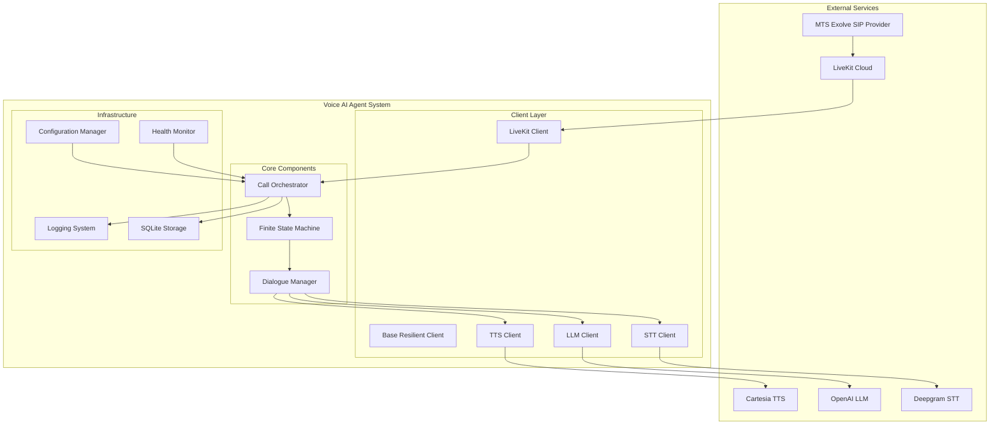

# Design Document

## Overview

The Voice AI Agent system is designed as a microservices-based architecture that orchestrates multiple AI services to provide natural voice conversations through telephone calls. The system follows a finite state machine pattern with three primary states (LISTENING, PROCESSING, SPEAKING) and implements resilient client patterns for external service integration.

The architecture prioritizes low latency (sub-1.5 second response times), high availability, and production readiness with comprehensive monitoring, logging, and automated deployment capabilities.

## Architecture

### High-Level Architecture



### Component Interaction Flow

1. **Call Initiation**: MTS Exolve routes incoming calls to LiveKit Cloud SIP endpoint
2. **Call Handling**: LiveKit streams audio to the Voice AI Agent system
3. **State Management**: Call Orchestrator manages conversation state through FSM
4. **Audio Processing**: STT Client converts speech to text via Deepgram
5. **Language Processing**: LLM Client generates responses using OpenAI
6. **Speech Synthesis**: TTS Client converts responses to audio via Cartesia
7. **Response Delivery**: Audio is streamed back through LiveKit to caller

## Components and Interfaces

### Core Components

#### Call Orchestrator
**Purpose**: Central coordinator managing the entire call lifecycle and component interactions.

**Key Responsibilities**:
- LiveKit event handling and audio stream management
- State machine coordination and transition management
- Dialogue history maintenance and context management
- Error handling and fallback response coordination
- Metrics collection and performance monitoring

**Interface**:
```python
class CallOrchestrator:
    async def handle_call_start(self, call_context: CallContext) -> None
    async def handle_audio_received(self, audio_data: bytes) -> None
    async def handle_call_end(self, call_context: CallContext) -> None
    async def get_health_status(self) -> HealthStatus
```

#### Finite State Machine
**Purpose**: Manages conversation states and ensures proper state transitions.

**States**:
- `LISTENING`: Waiting for and capturing user speech
- `PROCESSING`: Converting speech to text, generating LLM response, and synthesizing speech
- `SPEAKING`: Playing generated audio response to caller

**Interface**:
```python
class ConversationStateMachine:
    def transition_to(self, new_state: ConversationState) -> bool
    def get_current_state(self) -> ConversationState
    def can_transition(self, from_state: ConversationState, to_state: ConversationState) -> bool
```

#### Dialogue Manager
**Purpose**: Maintains conversation context and coordinates AI service interactions.

**Key Responsibilities**:
- Conversation history management with context window optimization
- Multi-turn dialogue context preservation
- Response generation coordination
- Conversation logging and analytics

**Interface**:
```python
class DialogueManager:
    async def process_user_input(self, text: str, context: ConversationContext) -> str
    async def add_to_history(self, role: str, content: str) -> None
    async def get_conversation_summary(self) -> ConversationSummary
```

### Client Layer

#### Base Resilient Client
**Purpose**: Provides common resilience patterns for all external service clients.

**Features**:
- Exponential backoff retry logic with configurable parameters
- Circuit breaker pattern for service failure handling
- Request/response logging and metrics collection
- Health check capabilities with service status monitoring

**Interface**:
```python
class BaseResilientClient:
    async def make_request(self, request_func: Callable, *args, **kwargs) -> Any
    async def health_check(self) -> ServiceHealth
    def get_metrics(self) -> ClientMetrics
```

#### STT Client (Deepgram Integration)
**Purpose**: Handles speech-to-text conversion with streaming and batch support.

**Features**:
- Real-time streaming transcription for low latency
- Automatic language detection and optimization
- Audio format handling and preprocessing
- Confidence scoring and quality metrics

**Interface**:
```python
class DeepgramSTTClient(BaseResilientClient):
    async def transcribe_stream(self, audio_stream: AsyncIterator[bytes]) -> AsyncIterator[str]
    async def transcribe_batch(self, audio_data: bytes) -> TranscriptionResult
```

#### LLM Client (OpenAI Integration)
**Purpose**: Manages language model interactions with context optimization.

**Features**:
- Context window management with intelligent truncation
- Token usage monitoring and cost calculation
- Response streaming for reduced latency
- Fallback response generation for service failures

**Interface**:
```python
class OpenAILLMClient(BaseResilientClient):
    async def generate_response(self, messages: List[Message], context: ConversationContext) -> str
    async def stream_response(self, messages: List[Message]) -> AsyncIterator[str]
    def calculate_token_usage(self, messages: List[Message]) -> TokenUsage
```

#### TTS Client (Cartesia Integration)
**Purpose**: Converts text responses to natural-sounding speech.

**Features**:
- Streaming audio synthesis for real-time playback
- Voice selection and customization
- Audio format optimization for telephony
- Quality and naturalness optimization

**Interface**:
```python
class CartesiaTTSClient(BaseResilientClient):
    async def synthesize_stream(self, text: str, voice_config: VoiceConfig) -> AsyncIterator[bytes]
    async def synthesize_batch(self, text: str, voice_config: VoiceConfig) -> bytes
```

## Data Models

### Core Data Structures

```python
@dataclass
class CallContext:
    call_id: str
    caller_number: str
    start_time: datetime
    livekit_room: str
    metadata: Dict[str, Any]

@dataclass
class ConversationContext:
    call_context: CallContext
    history: List[Message]
    current_state: ConversationState
    metrics: ConversationMetrics

@dataclass
class Message:
    role: str  # 'user' | 'assistant' | 'system'
    content: str
    timestamp: datetime
    metadata: Optional[Dict[str, Any]] = None

@dataclass
class TranscriptionResult:
    text: str
    confidence: float
    language: str
    duration: float
    alternatives: List[str]

@dataclass
class ConversationMetrics:
    total_duration: float
    processing_latency: float
    stt_latency: float
    llm_latency: float
    tts_latency: float
    token_usage: TokenUsage
    api_costs: Dict[str, float]
```

### Configuration Models

```python
class Settings(BaseSettings):
    # Domain and Network
    domain: str
    public_ip: str
    
    # SIP Configuration
    sip_number: str
    sip_server: str
    sip_username: str
    sip_password: str
    
    # LiveKit Configuration
    livekit_url: str
    livekit_api_key: str
    livekit_api_secret: str
    livekit_sip_uri: str
    
    # AI Services
    deepgram_api_key: str
    openai_api_key: str
    cartesia_api_key: str
    
    # Performance Settings
    max_response_latency: float = 1.5
    context_window_size: int = 4000
    retry_attempts: int = 3
    
    class Config:
        env_file = ".env"
        validate_assignment = True
```

## Error Handling

### Error Categories and Strategies

1. **Network Errors**: Implement exponential backoff with circuit breaker pattern
2. **API Rate Limits**: Queue requests with intelligent throttling
3. **Service Unavailability**: Provide fallback responses to maintain conversation flow
4. **Audio Processing Errors**: Graceful degradation with error notifications
5. **Configuration Errors**: Fail fast at startup with clear error messages

### Fallback Mechanisms

- **STT Failures**: Request caller to repeat or provide alternative input methods
- **LLM Failures**: Use pre-configured fallback responses based on conversation context
- **TTS Failures**: Convert to simple text-based responses or system announcements
- **LiveKit Disconnection**: Attempt reconnection with exponential backoff

## Testing Strategy

### Unit Testing
- **Component Isolation**: Mock all external dependencies for pure unit tests
- **Client Testing**: Test resilience patterns with simulated failures
- **State Machine Testing**: Verify all valid state transitions and error conditions
- **Configuration Testing**: Validate all environment variable combinations

### Integration Testing
- **API Integration**: Test actual API calls with rate limiting and error scenarios
- **End-to-End Flows**: Simulate complete conversation flows with real services
- **Performance Testing**: Measure latency under various load conditions
- **Failure Scenarios**: Test system behavior during partial service outages

### Load Testing
- **Concurrent Calls**: Test system behavior with multiple simultaneous calls
- **Resource Utilization**: Monitor memory and CPU usage under load
- **Latency Measurement**: Ensure sub-1.5 second response times under load
- **Stability Testing**: Verify 8+ hour continuous operation

### Monitoring and Observability

#### Metrics Collection
- **Call Metrics**: Duration, success rate, abandonment rate
- **Performance Metrics**: End-to-end latency, component-level timing
- **API Metrics**: Request counts, error rates, token usage, costs
- **System Metrics**: CPU, memory, network utilization

#### Health Checks
- **Component Health**: Individual service client status
- **External Service Health**: API availability and response times
- **System Health**: Overall application status and readiness

#### Logging Strategy
- **Structured Logging**: JSON format with consistent field naming
- **Log Levels**: DEBUG for development, INFO for production events, ERROR for failures
- **Sensitive Data**: Exclude or mask PII and API keys from logs
- **Correlation IDs**: Track requests across component boundaries