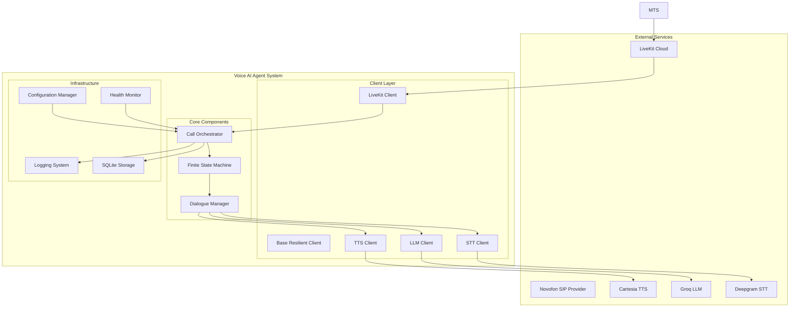

# Voice AI Agent - Comprehensive Project Documentation

## Table of Contents

1. [Project Overview](#project-overview)
2. [Architecture](#architecture)
3. [Technology Stack](#technology-stack)
4. [Directory Structure](#directory-structure)
5. [Core Components](#core-components)
6. [Configuration](#configuration)
7. [Development Setup](#development-setup)
8. [Testing Strategy](#testing-strategy)
9. [Deployment](#deployment)
10. [Monitoring & Observability](#monitoring--observability)
11. [Security](#security)
12. [Troubleshooting](#troubleshooting)
13. [API Reference](#api-reference)

## Project Overview

The Voice AI Agent is a production-ready system that enables natural voice conversations through telephone calls. It integrates multiple AI services (speech-to-text, language processing, text-to-speech) with telephony infrastructure to create an intelligent voice assistant.

### Key Features

- **Real-time Voice Processing**: Sub-1.5 second response times for natural conversations
- **Multi-AI Integration**: Seamless integration with Deepgram (STT), Groq (LLM), and Cartesia (TTS)
- **Production Ready**: Comprehensive monitoring, logging, and deployment automation
- **Scalable Architecture**: Microservices-based design with resilient client patterns
- **Security First**: Comprehensive security measures and data protection
- **Telephony Integration**: LiveKit SIP integration for real phone connectivity

### System Requirements

- **Runtime**: Python 3.12+
- **Database**: SQLite (production) / In-memory (testing)
- **Container**: Docker & Docker Compose
- **Monitoring**: Prometheus, Grafana, Loki
- **External Services**: Deepgram, Groq, Cartesia, LiveKit

## Architecture

### High-Level Architecture



### Data Flow

1. **Incoming Call**: Novofon → LiveKit → Voice AI Agent
2. **Audio Processing**: Audio Stream → STT Client → Deepgram
3. **Language Processing**: Transcribed Text → LLM Client → Groq
4. **Speech Synthesis**: Generated Response → TTS Client → Cartesia
5. **Response Delivery**: Synthesized Audio → LiveKit → Caller

## Technology Stack

### Core Technologies
- **Python 3.12**: Primary runtime environment
- **FastAPI**: Web framework for API endpoints
- **Pydantic**: Data validation and settings management
- **SQLAlchemy**: Database ORM and migrations
- **AsyncIO**: Asynchronous programming support

### AI Services
- **Deepgram**: Speech-to-Text (STT) processing
- **Groq**: Large Language Model (LLM) inference
- **Cartesia**: Text-to-Speech (TTS) synthesis
- **LiveKit**: Real-time communication platform

### Infrastructure
- **Docker**: Containerization platform
- **Docker Compose**: Multi-container orchestration
- **Prometheus**: Metrics collection and monitoring
- **Grafana**: Visualization and dashboards
- **Loki**: Log aggregation and analysis
- **Redis**: Caching and session storage

### Development Tools
- **pytest**: Testing framework
- **black**: Code formatting
- **ruff**: Linting and code analysis
- **mypy**: Static type checking
- **pre-commit**: Git hooks for code quality

## Directory Structure

```
voice-ai-agent/
├── .github/workflows/          # CI/CD pipeline configurations
├── .kiro/                      # Kiro IDE specifications and settings
├── config/                     # Application configuration files
├── data/                       # Database files and data storage
├── docs/                       # Project documentation
├── examples/                   # Usage examples and demos
├── monitoring/                 # Monitoring stack configurations
├── scripts/                    # Deployment and utility scripts
├── security/                   # Security configurations and tools
├── src/                        # Main application source code
│   ├── clients/               # External service client implementations
│   ├── conversation/          # Conversation management components
│   ├── database/              # Database models and operations
│   ├── middleware/            # Request/response middleware
│   └── monitoring/            # Health checks and metrics
├── tests/                      # Test suite and test utilities
├── docker-compose.yml          # Development environment setup
├── docker-compose.prod.yml     # Production environment setup
├── Dockerfile                  # Container image definition
├── Makefile                    # Development automation commands
├── pyproject.toml             # Python project configuration
└── requirements.txt           # Python dependencies
```

## Core Components

### Call Orchestrator (`src/orchestrator.py`)
Central coordinator managing the entire call lifecycle and component interactions.

**Key Responsibilities:**
- LiveKit event handling and audio stream management
- State machine coordination and transition management
- Dialogue history maintenance and context management
- Error handling and fallback response coordination
- Metrics collection and performance monitoring

### Finite State Machine (`src/conversation/state_machine.py`)
Manages conversation states and ensures proper state transitions.

**States:**
- `LISTENING`: Waiting for and capturing user speech
- `PROCESSING`: Converting speech to text, generating LLM response, and synthesizing speech
- `SPEAKING`: Playing generated audio response to caller

### Dialogue Manager (`src/conversation/dialogue_manager.py`)
Maintains conversation context and coordinates AI service interactions.

**Features:**
- Conversation history management with context window optimization
- Multi-turn dialogue context preservation
- Response generation coordination
- Conversation logging and analytics

### Client Layer (`src/clients/`)
Resilient client implementations for external service integration.

**Base Client (`src/clients/base.py`):**
- Exponential backoff retry logic
- Circuit breaker pattern for service failures
- Request/response logging and metrics collection
- Health check capabilities

**Service Clients:**
- **STT Client** (`src/clients/deepgram_stt.py`): Deepgram integration
- **LLM Client** (`src/clients/groq_llm.py`): Groq integration
- **TTS Client** (`src/clients/cartesia_tts.py`): Cartesia integration

## Configuration

### Environment Variables

The system uses environment-based configuration with validation through Pydantic settings.

**Core Configuration (`src/config.py`):**
```python
class Settings(BaseSettings):
    # Domain and Network
    domain: str
    public_ip: str
    
    # SIP Configuration
    sip_number: str
    sip_server: str
    sip_username: str
    sip_password: str
    
    # LiveKit Configuration
    livekit_url: str
    livekit_api_key: str
    livekit_api_secret: str
    
    # AI Services
    deepgram_api_key: str
    groq_api_key: str
    cartesia_api_key: str
    
    # Performance Settings
    max_response_latency: float = 1.5
    context_window_size: int = 4000
    retry_attempts: int = 3
```

### Configuration Files

- **`.env`**: Development environment variables
- **`.env.production`**: Production environment variables
- **`.env.template`**: Template with all required variables
- **`config/production.yaml`**: Production-specific settings
- **`livekit-sip.yaml`**: LiveKit SIP integration configuration

## Development Setup

### Prerequisites

1. **Python 3.12+**: Install from [python.org](https://python.org)
2. **Docker & Docker Compose**: Install from [docker.com](https://docker.com)
3. **API Keys**: Obtain keys for Deepgram, Groq, Cartesia, and LiveKit

### Quick Start

1. **Clone Repository:**
   ```bash
   git clone <repository-url>
   cd voice-ai-agent
   ```

2. **Setup Environment:**
   ```bash
   make setup
   ```

3. **Configure Environment Variables:**
   ```bash
   cp .env.template .env
   # Edit .env with your API keys and configuration
   ```

4. **Run Development Environment:**
   ```bash
   make run
   ```

5. **Run Tests:**
   ```bash
   make test
   ```

### Development Commands

The `Makefile` provides comprehensive development automation:

```bash
make setup          # Install dependencies and setup environment
make test           # Run test suite with coverage
make lint           # Run code linting and formatting
make format         # Format code with black and ruff
make run            # Start development server
make stop           # Stop all services
make clean          # Clean temporary files and caches
make health         # Check system health status
```

## Testing Strategy

### Test Structure

```
tests/
├── test_clients/              # Client implementation tests
├── test_conversation/         # Conversation management tests
├── test_database/            # Database operation tests
├── test_config.py            # Configuration validation tests
├── test_health.py            # Health check tests
├── test_e2e_integration.py   # End-to-end integration tests
├── test_load_testing.py      # Performance and load tests
└── test_security.py          # Security validation tests
```

### Test Categories

1. **Unit Tests**: Individual component testing with mocked dependencies
2. **Integration Tests**: Component interaction testing with real services
3. **End-to-End Tests**: Complete conversation flow testing
4. **Load Tests**: Performance testing under concurrent load
5. **Security Tests**: Input validation and security measure testing

### Running Tests

```bash
# Run all tests
make test

# Run specific test categories
pytest tests/test_clients/
pytest tests/test_e2e_integration.py
pytest tests/test_load_testing.py

# Run with coverage
pytest --cov=src --cov-report=html
```

## Deployment

### Production Deployment

The system supports containerized deployment with comprehensive monitoring.

**Deployment Steps:**

1. **Prepare Environment:**
   ```bash
   ./scripts/setup_production_env.sh
   ```

2. **Deploy System:**
   ```bash
   ./scripts/deploy_production.sh
   ```

3. **Validate Deployment:**
   ```bash
   ./scripts/validate_deployment.py
   ```

### Docker Compose Services

**Production Stack (`docker-compose.prod.yml`):**
- **voice-ai-agent**: Main application container
- **prometheus**: Metrics collection
- **grafana**: Visualization dashboards
- **loki**: Log aggregation
- **redis**: Caching and session storage

### Health Monitoring

The system includes comprehensive health monitoring:

- **Application Health**: `/health` endpoint
- **Component Health**: Individual service status
- **System Metrics**: Performance and resource utilization
- **Alerting**: Automated alerts for failures and degradation

## Monitoring & Observability

### Metrics Collection

**Application Metrics:**
- Call duration and success rates
- End-to-end response latency
- Component-level performance timing
- API usage and cost tracking

**System Metrics:**
- CPU and memory utilization
- Network throughput and latency
- Database performance
- Container resource usage

### Logging

**Structured Logging:**
- JSON format with consistent field naming
- Correlation IDs for request tracking
- Sensitive data exclusion
- Configurable log levels

**Log Aggregation:**
- Centralized logging with Loki
- Log retention and rotation policies
- Search and analysis capabilities
- Alert integration

### Dashboards

**Grafana Dashboards:**
- System overview and health status
- Performance metrics and trends
- Error rates and failure analysis
- Cost tracking and optimization

## Security

### Security Measures

1. **API Key Management**: Secure environment variable storage
2. **Data Validation**: Input sanitization and validation
3. **Network Security**: Firewall rules and access controls
4. **Container Security**: Image scanning and runtime protection
5. **Audit Logging**: Security event tracking and analysis

### Security Configuration

**Files:**
- `security/firewall_config.py`: Network security rules
- `security/ssl_setup.py`: TLS/SSL certificate management
- `security/secrets_manager.py`: Credential management
- `security/security-audit-report.md`: Security assessment results

### Best Practices

- Regular security updates and patches
- Principle of least privilege access
- Encrypted data transmission
- Secure credential rotation
- Vulnerability scanning and assessment

## Troubleshooting

### Common Issues

1. **API Connection Failures**
   - Verify API keys and network connectivity
   - Check service status and rate limits
   - Review client retry and circuit breaker logs

2. **Audio Processing Issues**
   - Validate audio format and quality
   - Check STT/TTS service configuration
   - Monitor processing latency and timeouts

3. **Container Health Issues**
   - Review container logs and resource usage
   - Validate environment variable configuration
   - Check service dependencies and startup order

### Diagnostic Tools

**Scripts:**
- `scripts/diagnose_sip_issue.py`: SIP connectivity diagnosis
- `scripts/health_monitor.py`: System health monitoring
- `scripts/deployment_health_check.py`: Deployment validation

**Commands:**
```bash
# Check system health
make health

# View application logs
docker-compose logs voice-ai-agent

# Monitor system metrics
docker-compose exec prometheus promtool query instant 'up'
```

## API Reference

### Health Check Endpoints

**GET /health**
Returns overall system health status.

**Response:**
```json
{
  "status": "healthy",
  "components": {
    "deepgram": "healthy",
    "groq": "healthy", 
    "cartesia": "healthy",
    "redis": "healthy"
  },
  "timestamp": "2025-01-01T00:00:00Z"
}
```

### Metrics Endpoints

**GET /metrics**
Returns Prometheus-formatted metrics.

### Configuration Endpoints

**GET /config/status**
Returns configuration validation status.

---

*This documentation is automatically generated and maintained as part of the Voice AI Agent project. For the most up-to-date information, refer to the source code and inline documentation.*