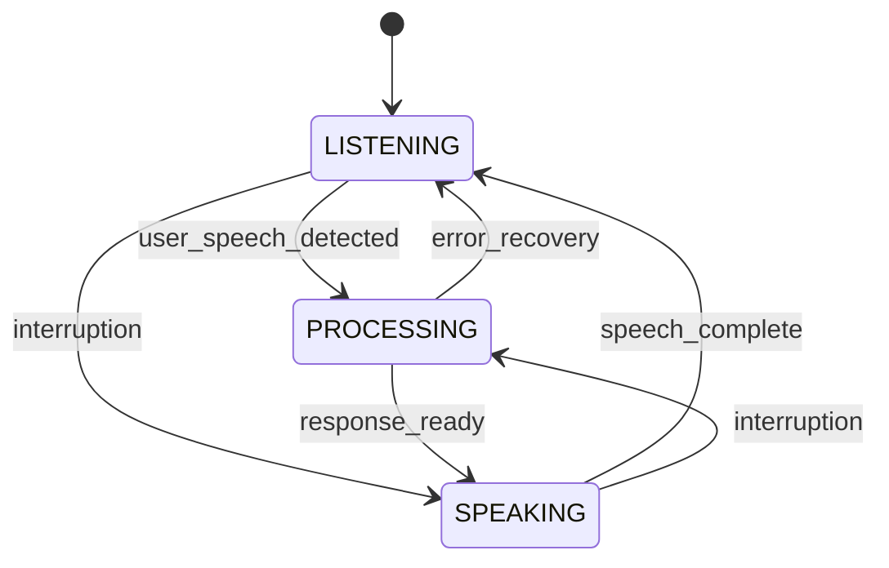

# Conversation State Machine

The Conversation State Machine is a core component of the Voice AI Agent system that manages conversation states and ensures proper state transitions during voice interactions.

## Overview

The state machine implements a finite state automaton with three primary states:

- **LISTENING**: Waiting for and capturing user speech
- **PROCESSING**: Converting speech to text, generating LLM response, and synthesizing speech  
- **SPEAKING**: Playing generated audio response to caller

## Architecture



## Key Features

### State Management
- **Validated Transitions**: Only allows valid state transitions based on predefined rules
- **State Duration Tracking**: Measures time spent in each state for performance analysis
- **Transition History**: Maintains a complete log of all state changes with metadata
- **Concurrent Safety**: Thread-safe operations using async locks

### Error Handling
- **Graceful Degradation**: Invalid transitions are logged but don't crash the system
- **Force Transitions**: Emergency state changes for error recovery scenarios
- **Handler Error Isolation**: State handler errors don't affect state transitions

### Monitoring & Analytics
- **Real-time Metrics**: Tracks transition counts, durations, and error rates
- **State Handlers**: Customizable callbacks for state entry events
- **Transition Callbacks**: Global callbacks for all state transitions
- **Performance Monitoring**: Built-in metrics for system optimization

## Usage

### Basic Usage

```python
from src.conversation.state_machine import ConversationState, ConversationStateMachine

# Create state machine
fsm = ConversationStateMachine()

# Transition to processing state
await fsm.transition_to(ConversationState.PROCESSING, "user_input_detected")

# Check current state
print(f"Current state: {fsm.current_state.value}")
```

### Adding State Handlers

```python
async def processing_handler(state: ConversationState, transition: StateTransition):
    """Handler called when entering PROCESSING state."""
    print(f"Started processing: {transition.trigger}")
    # Start STT, LLM, and TTS processing

# Add handler for processing state
fsm.add_state_handler(ConversationState.PROCESSING, processing_handler)
```

### Adding Transition Callbacks

```python
async def log_transitions(transition: StateTransition):
    """Log all state transitions."""
    logger.info(
        f"Transition: {transition.from_state.value} -> {transition.to_state.value}"
    )

# Add global transition callback
fsm.add_transition_callback(log_transitions)
```

### Temporary States

```python
# Use context manager for temporary state changes
async with fsm.temporary_state(ConversationState.PROCESSING, "temp_processing"):
    # Perform temporary processing
    await process_urgent_request()
# Automatically returns to previous state
```

### Error Recovery

```python
# Force transition for error recovery (bypasses validation)
await fsm.force_transition(ConversationState.LISTENING, "error_recovery")
```

## State Transitions

### Valid Transitions

| From State | To State | Description |
|------------|----------|-------------|
| LISTENING | PROCESSING | User starts speaking |
| LISTENING | SPEAKING | Direct response (interruption) |
| PROCESSING | SPEAKING | Response generation complete |
| PROCESSING | LISTENING | Error recovery |
| SPEAKING | LISTENING | Speech playback complete |
| SPEAKING | PROCESSING | User interruption |

### Transition Triggers

Common trigger values used in the system:

- `user_speech_detected` - User starts speaking
- `speech_silence_detected` - User stops speaking
- `stt_complete` - Speech-to-text processing finished
- `llm_response_ready` - Language model response generated
- `tts_synthesis_complete` - Text-to-speech synthesis finished
- `audio_playback_complete` - Audio playback finished
- `user_interruption` - User interrupts system speech
- `error_recovery` - System error recovery
- `timeout` - Operation timeout

## Metrics and Monitoring

### State Metrics

The state machine provides comprehensive metrics:

```python
# Get current metrics
metrics = fsm.metrics

print(f"Total transitions: {metrics.total_transitions}")
print(f"Invalid transitions: {metrics.invalid_transitions}")
print(f"State durations: {metrics.state_durations}")
```

### State Summary

```python
# Get complete state summary
summary = fsm.get_state_summary()

# Example output:
{
    "current_state": "listening",
    "previous_state": "speaking", 
    "total_transitions": 15,
    "invalid_transitions": 0,
    "state_durations": {
        "listening": 45.2,
        "processing": 12.8,
        "speaking": 23.1
    },
    "transition_count": 15
}
```

### Transition History

```python
# Get recent transition history
history = fsm.get_transition_history(limit=10)

for transition in history:
    print(f"{transition.timestamp}: {transition.from_state.value} -> {transition.to_state.value}")
```

## Integration with Voice AI Agent

### Call Orchestrator Integration

```python
class CallOrchestrator:
    def __init__(self):
        self.fsm = ConversationStateMachine()
        self._setup_state_handlers()
    
    def _setup_state_handlers(self):
        """Configure state handlers for conversation management."""
        self.fsm.add_state_handler(ConversationState.LISTENING, self._handle_listening)
        self.fsm.add_state_handler(ConversationState.PROCESSING, self._handle_processing)
        self.fsm.add_state_handler(ConversationState.SPEAKING, self._handle_speaking)
    
    async def _handle_listening(self, state: ConversationState, transition: StateTransition):
        """Handle entering listening state."""
        # Start audio capture
        # Enable voice activity detection
        pass
    
    async def _handle_processing(self, state: ConversationState, transition: StateTransition):
        """Handle entering processing state."""
        # Stop audio capture
        # Start STT processing
        # Generate LLM response
        # Synthesize TTS audio
        pass
    
    async def _handle_speaking(self, state: ConversationState, transition: StateTransition):
        """Handle entering speaking state."""
        # Start audio playback
        # Monitor for user interruptions
        pass
```

### Event-Driven Transitions

```python
async def handle_audio_received(self, audio_data: bytes):
    """Handle incoming audio data."""
    if self.fsm.current_state == ConversationState.LISTENING:
        if self._detect_speech_start(audio_data):
            await self.fsm.transition_to(
                ConversationState.PROCESSING, 
                "user_speech_detected"
            )

async def handle_llm_response_ready(self, response: str):
    """Handle LLM response completion."""
    if self.fsm.current_state == ConversationState.PROCESSING:
        await self.fsm.transition_to(
            ConversationState.SPEAKING,
            "llm_response_ready"
        )

async def handle_tts_playback_complete(self):
    """Handle TTS playback completion."""
    if self.fsm.current_state == ConversationState.SPEAKING:
        await self.fsm.transition_to(
            ConversationState.LISTENING,
            "tts_playback_complete"
        )
```

## Performance Considerations

### State Duration Optimization

Monitor state durations to identify performance bottlenecks:

```python
# Analyze state performance
summary = fsm.get_state_summary()
durations = summary['state_durations']

if durations['processing'] > 1.5:  # Target: <1.5s response time
    logger.warning("Processing state taking too long")
    # Optimize STT, LLM, or TTS performance
```

### Memory Management

The state machine automatically manages memory usage:

- Transition history is bounded (configurable limit)
- State metrics are lightweight and reset on conversation end
- No memory leaks from handler/callback registration

### Concurrent Access

The state machine is designed for high-concurrency scenarios:

- Async locks prevent race conditions
- Non-blocking state queries
- Safe concurrent handler execution

## Error Handling

### Invalid Transitions

```python
# Invalid transitions are logged but don't raise exceptions
result = await fsm.transition_to(ConversationState.PROCESSING, "invalid")
if not result:
    logger.warning("Transition failed - invalid state change")
```

### Handler Errors

```python
async def failing_handler(state, transition):
    raise Exception("Handler error")

# Handler errors are caught and logged, but don't affect transitions
fsm.add_state_handler(ConversationState.PROCESSING, failing_handler)
await fsm.transition_to(ConversationState.PROCESSING, "test")  # Still succeeds
```

### Recovery Mechanisms

```python
# Force transition for emergency recovery
if system_error_detected:
    await fsm.force_transition(ConversationState.LISTENING, "emergency_recovery")
    
# Reset state machine for new conversation
fsm.reset(ConversationState.LISTENING)
```

## Testing

The state machine includes comprehensive unit tests covering:

- All valid state transitions
- Invalid transition handling
- Concurrent access safety
- Handler and callback execution
- Error recovery scenarios
- Metrics accuracy
- Memory management

Run tests with:

```bash
python -m pytest tests/test_conversation/test_state_machine.py -v
```

## Configuration

### Environment Variables

No specific environment variables are required for the state machine itself, but it integrates with the main application configuration:

```python
from src.config import Settings

settings = Settings()

# Use configuration for state machine behavior
fsm = ConversationStateMachine(
    initial_state=ConversationState.LISTENING
)
```

### Logging Configuration

Configure logging to monitor state machine behavior:

```python
import logging

# Enable state machine logging
logging.getLogger('src.conversation.state_machine').setLevel(logging.INFO)
```

## Best Practices

### State Handler Design

1. **Keep handlers lightweight** - Avoid blocking operations
2. **Use async/await** - All handlers should be async
3. **Handle errors gracefully** - Don't let handler errors propagate
4. **Log important events** - Use structured logging for debugging

### Transition Management

1. **Use descriptive triggers** - Make transition reasons clear
2. **Include metadata** - Add context for debugging and analytics
3. **Validate before transitions** - Check preconditions when possible
4. **Monitor metrics** - Track performance and error rates

### Error Recovery

1. **Prefer graceful transitions** - Use valid transitions when possible
2. **Force transitions sparingly** - Only for true emergencies
3. **Log recovery actions** - Document why recovery was needed
4. **Reset when appropriate** - Clean slate for new conversations

## Troubleshooting

### Common Issues

**State machine stuck in processing state:**
- Check if processing handlers are completing
- Look for unhandled exceptions in STT/LLM/TTS clients
- Monitor processing duration metrics

**Invalid transition errors:**
- Review transition logic in application code
- Check if state handlers are changing state unexpectedly
- Verify transition triggers match expected flow

**Memory usage growing:**
- Check transition history size
- Ensure state machine reset between conversations
- Monitor handler/callback registration

### Debugging

Enable debug logging for detailed state machine behavior:

```python
import logging
logging.getLogger('src.conversation.state_machine').setLevel(logging.DEBUG)
```

Use state summary for runtime inspection:

```python
# Get current state machine status
summary = fsm.get_state_summary()
print(f"State machine status: {summary}")
```

## Future Enhancements

Potential improvements for future versions:

1. **State Persistence** - Save/restore state across system restarts
2. **Custom State Types** - Support for application-specific states
3. **Transition Conditions** - Conditional transitions based on context
4. **State Timeouts** - Automatic transitions after time limits
5. **Metrics Export** - Integration with monitoring systems
6. **Visual State Monitoring** - Real-time state visualization dashboard