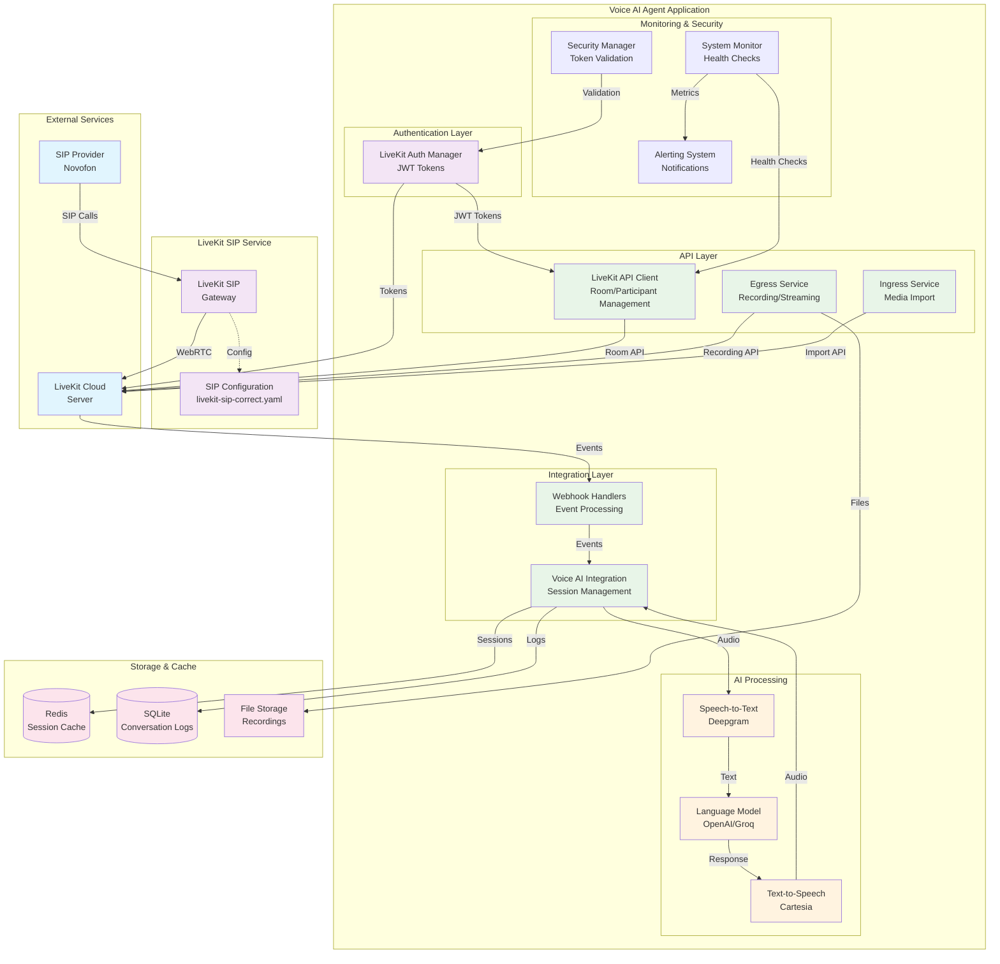
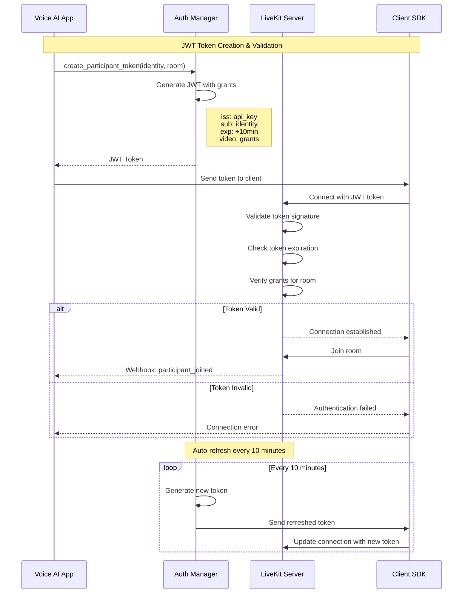
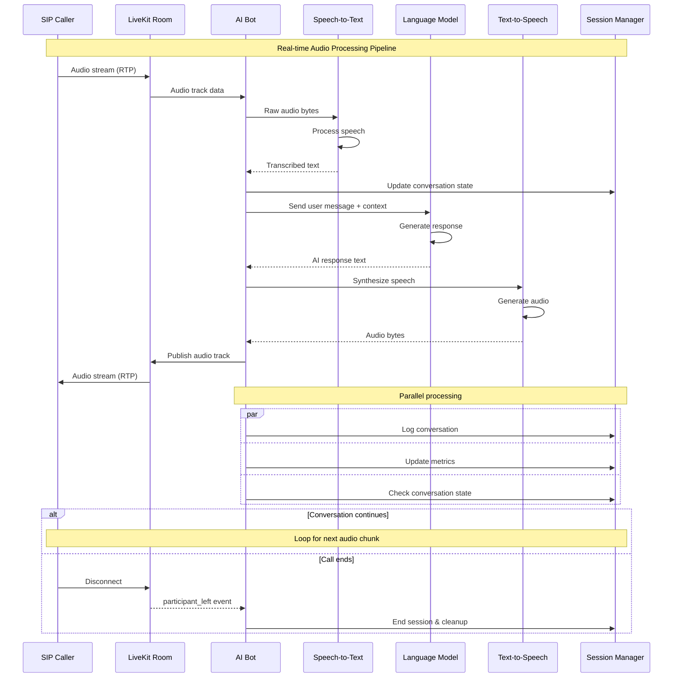
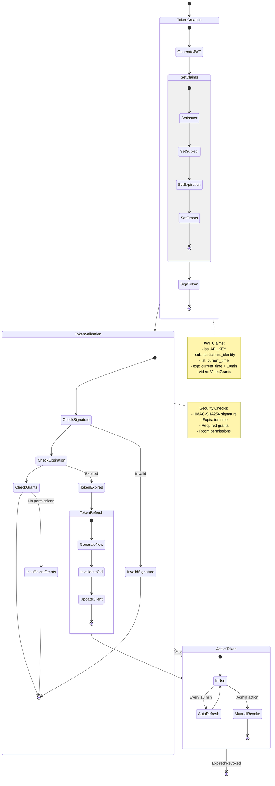
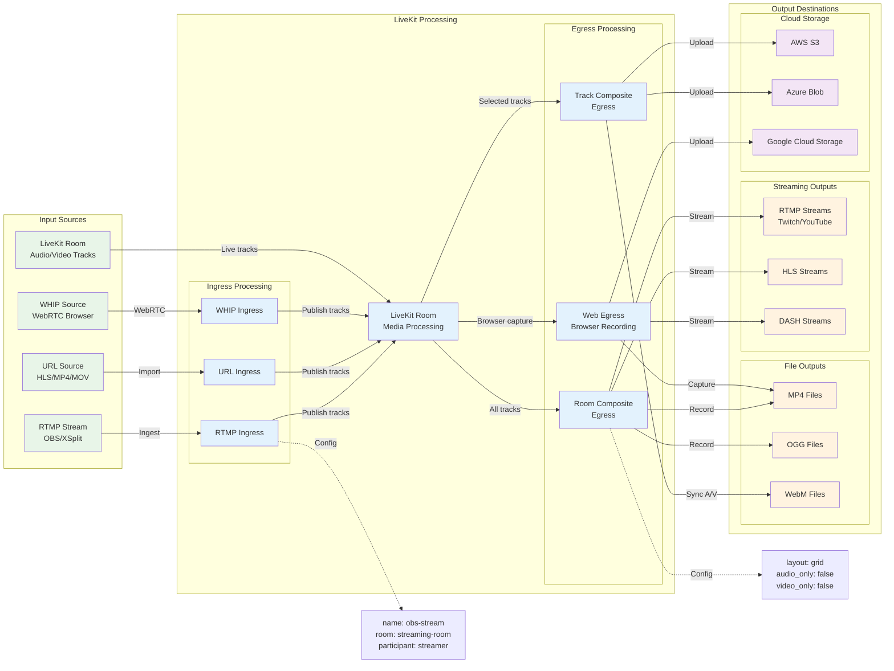
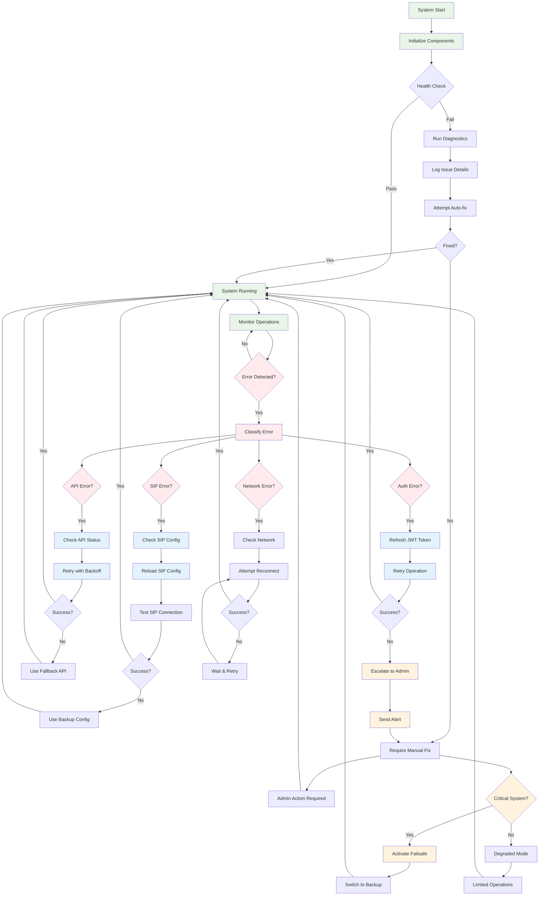
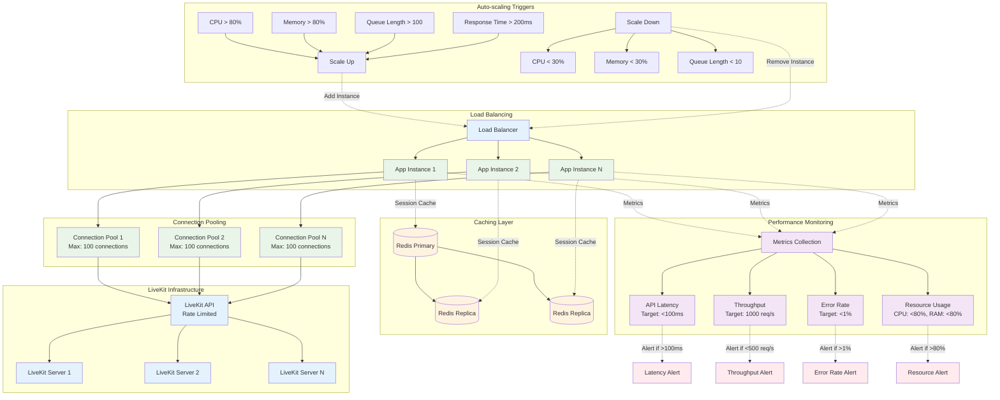

# Схемы архитектуры и диаграммы системы LiveKit

## Обзор

Данный документ содержит архитектурные диаграммы и схемы системы LiveKit, интегрированной с Voice AI Agent. Диаграммы созданы с использованием Mermaid для наглядного представления компонентов, потоков данных и взаимодействий.

## 1. Общая архитектура системы



## 2. Поток аутентификации



## 3. SIP интеграция и маршрутизация

```mermaid
flowchart TD
    subgraph "SIP Provider"
        CALLER[Caller<br/>+1234567890]
    end
    
    subgraph "LiveKit SIP Gateway"
        TRUNK[SIP Trunk<br/>novofon-inbound]
        ROUTING[Routing Rules<br/>voice-ai-dispatch]
        DISPATCH[Dispatch Logic]
    end
    
    subgraph "LiveKit Server"
        ROOM[LiveKit Room<br/>voice-ai-call-{id}]
        PARTICIPANT[SIP Participant<br/>caller_+1234567890]
    end
    
    subgraph "Voice AI Agent"
        WEBHOOK[Webhook Handler]
        SESSION[AI Session Manager]
        AIBOT[AI Bot Participant]
    end
    
    %% Call flow
    CALLER -->|1. Incoming Call| TRUNK
    TRUNK -->|2. Match Number| ROUTING
    ROUTING -->|3. Apply Rules| DISPATCH
    DISPATCH -->|4. Create Room| ROOM
    ROOM -->|5. Add Participant| PARTICIPANT
    
    %% Webhook flow
    ROOM -.->|6. room_started| WEBHOOK
    PARTICIPANT -.->|7. participant_joined| WEBHOOK
    WEBHOOK -->|8. Create Session| SESSION
    SESSION -->|9. Join as AI Bot| AIBOT
    AIBOT -->|10. Connect to Room| ROOM
    
    %% Configuration details
    TRUNK -.->|Config| TRUNKCONFIG[numbers: ${SIP_NUMBER}<br/>allowed_addresses: 0.0.0.0/0<br/>auth_required: false]
    ROUTING -.->|Config| ROUTECONFIG[match: to=${SIP_NUMBER}<br/>action: livekit_room<br/>template: voice-ai-call-{call_id}]
    
    %% Styling
    classDef sip fill:#e3f2fd
    classDef livekit fill:#f1f8e9
    classDef ai fill:#fff8e1
    classDef config fill:#fce4ec
    
    class CALLER,TRUNK sip
    class ROUTING,DISPATCH,ROOM,PARTICIPANT livekit
    class WEBHOOK,SESSION,AIBOT ai
    class TRUNKCONFIG,ROUTECONFIG config
```

## 4. Voice AI обработка аудио



## 5. Мониторинг и health checks

```mermaid
graph TB
    subgraph "Monitoring System"
        MONITOR[System Monitor]
        HEALTH[Health Checker]
        METRICS[Metrics Collector]
        ALERTS[Alert Manager]
    end
    
    subgraph "Health Check Targets"
        subgraph "LiveKit Services"
            ROOMAPI[Room Service API]
            EGRESSAPI[Egress API]
            INGRESSAPI[Ingress API]
            SIPAPI[SIP API]
        end
        
        subgraph "External Services"
            LKSERVER[LiveKit Server]
            REDIS[Redis Cache]
            SIPGW[SIP Gateway]
        end
        
        subgraph "AI Services"
            STTSERVICE[STT Service]
            LLMSERVICE[LLM Service]
            TTSSERVICE[TTS Service]
        end
    end
    
    subgraph "Monitoring Outputs"
        DASHBOARD[Grafana Dashboard]
        LOGS[Structured Logs]
        WEBHOOKS[Alert Webhooks]
        PROMETHEUS[Prometheus Metrics]
    end
    
    %% Health check flows
    MONITOR -->|Check every 60s| HEALTH
    HEALTH -->|Test endpoints| ROOMAPI
    HEALTH -->|Test endpoints| EGRESSAPI
    HEALTH -->|Test endpoints| INGRESSAPI
    HEALTH -->|Test endpoints| SIPAPI
    
    HEALTH -->|Ping/Connect| LKSERVER
    HEALTH -->|Redis PING| REDIS
    HEALTH -->|SIP OPTIONS| SIPGW
    
    HEALTH -->|API calls| STTSERVICE
    HEALTH -->|API calls| LLMSERVICE
    HEALTH -->|API calls| TTSSERVICE
    
    %% Metrics collection
    MONITOR -->|Collect metrics| METRICS
    METRICS -->|Performance data| PROMETHEUS
    METRICS -->|System stats| DASHBOARD
    
    %% Alerting
    HEALTH -->|Status changes| ALERTS
    METRICS -->|Threshold breaches| ALERTS
    ALERTS -->|Notifications| WEBHOOKS
    ALERTS -->|Log events| LOGS
    
    %% Health status indicators
    ROOMAPI -.->|✓ Healthy<br/>⚠ Degraded<br/>✗ Unhealthy| HEALTHSTATUS[Health Status]
    EGRESSAPI -.->|Latency: <100ms<br/>Success: >99%| HEALTHSTATUS
    INGRESSAPI -.->|Connections: Active<br/>Errors: <1%| HEALTHSTATUS
    
    %% Styling
    classDef monitor fill:#e8f5e8
    classDef service fill:#e3f2fd
    classDef external fill:#fff3e0
    classDef output fill:#f3e5f5
    
    class MONITOR,HEALTH,METRICS,ALERTS monitor
    class ROOMAPI,EGRESSAPI,INGRESSAPI,SIPAPI service
    class LKSERVER,REDIS,SIPGW,STTSERVICE,LLMSERVICE,TTSSERVICE external
    class DASHBOARD,LOGS,WEBHOOKS,PROMETHEUS output
```



## 6. Безопасность и управление токенами



## 7. Egress и Ingress потоки данных



## 8. Обработка ошибок и восстановление



## 9. Производительность и масштабирование



## 10. Развертывание и CI/CD

```mermaid
gitgraph
    commit id: "Initial Setup"
    branch development
    checkout development
    commit id: "Add Auth Manager"
    commit id: "Add API Client"
    commit id: "Add SIP Config"
    
    branch feature/monitoring
    checkout feature/monitoring
    commit id: "Add Health Checks"
    commit id: "Add Metrics"
    commit id: "Add Alerting"
    
    checkout development
    merge feature/monitoring
    commit id: "Integration Tests"
    
    branch feature/security
    checkout feature/security
    commit id: "Add Token Validation"
    commit id: "Add Security Audit"
    
    checkout development
    merge feature/security
    commit id: "Security Tests"
    
    checkout main
    merge development
    commit id: "Release v1.0.0"
    
    branch hotfix/auth-fix
    checkout hotfix/auth-fix
    commit id: "Fix Token Refresh"
    
    checkout main
    merge hotfix/auth-fix
    commit id: "Release v1.0.1"
    
    checkout development
    merge main
    commit id: "Sync with main"
```

### CI/CD Pipeline

```mermaid
flowchart LR
    subgraph "Source Control"
        GIT[Git Repository]
        PR[Pull Request]
    end
    
    subgraph "CI Pipeline"
        LINT[Code Linting<br/>flake8, black]
        TEST[Unit Tests<br/>pytest]
        INTEGRATION[Integration Tests<br/>LiveKit API]
        SECURITY[Security Scan<br/>bandit, safety]
        BUILD[Build Docker Image]
    end
    
    subgraph "CD Pipeline"
        STAGING[Deploy to Staging]
        E2E[E2E Tests]
        APPROVAL[Manual Approval]
        PRODUCTION[Deploy to Production]
    end
    
    subgraph "Monitoring"
        HEALTHCHECK[Health Check]
        ROLLBACK[Auto Rollback]
        METRICS[Deployment Metrics]
    end
    
    %% CI flow
    GIT --> PR
    PR --> LINT
    LINT --> TEST
    TEST --> INTEGRATION
    INTEGRATION --> SECURITY
    SECURITY --> BUILD
    
    %% CD flow
    BUILD --> STAGING
    STAGING --> E2E
    E2E --> APPROVAL
    APPROVAL --> PRODUCTION
    
    %% Monitoring flow
    PRODUCTION --> HEALTHCHECK
    HEALTHCHECK -->|Fail| ROLLBACK
    HEALTHCHECK -->|Pass| METRICS
    ROLLBACK --> STAGING
    
    %% Quality gates
    LINT -.->|Fail| FAIL1[❌ Pipeline Failed]
    TEST -.->|Fail| FAIL2[❌ Pipeline Failed]
    INTEGRATION -.->|Fail| FAIL3[❌ Pipeline Failed]
    SECURITY -.->|Fail| FAIL4[❌ Pipeline Failed]
    E2E -.->|Fail| FAIL5[❌ Deployment Failed]
    
    %% Styling
    classDef source fill:#e8f5e8
    classDef ci fill:#e3f2fd
    classDef cd fill:#fff3e0
    classDef monitor fill:#f3e5f5
    classDef fail fill:#ffebee
    
    class GIT,PR source
    class LINT,TEST,INTEGRATION,SECURITY,BUILD ci
    class STAGING,E2E,APPROVAL,PRODUCTION cd
    class HEALTHCHECK,ROLLBACK,METRICS monitor
    class FAIL1,FAIL2,FAIL3,FAIL4,FAIL5 fail
```



## Заключение

Данные диаграммы и схемы предоставляют полное представление об архитектуре системы LiveKit, интегрированной с Voice AI Agent. Они помогают понять:

1. **Общую архитектуру** - как компоненты взаимодействуют друг с другом
2. **Потоки данных** - как информация перемещается через систему
3. **Безопасность** - как обеспечивается защита и аутентификация
4. **Производительность** - как система масштабируется и оптимизируется
5. **Мониторинг** - как отслеживается состояние системы
6. **Развертывание** - как система разворачивается и обновляется

Используйте эти диаграммы для:
- Понимания архитектуры системы
- Планирования изменений и улучшений
- Обучения новых разработчиков
- Документирования решений по дизайну
- Troubleshooting проблем

Все диаграммы созданы в формате Mermaid и могут быть легко обновлены и модифицированы по мере развития системы.