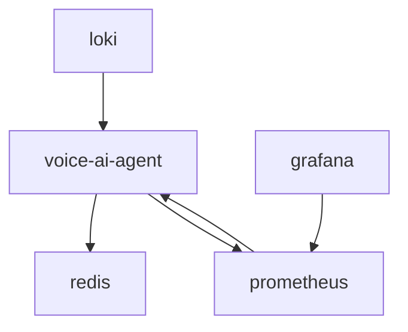

# Voice AI Agent Production Deployment Guide

This comprehensive guide covers the complete production deployment process for the Voice AI Agent system, including configuration, deployment, monitoring, and maintenance procedures.

## Table of Contents

1. [Prerequisites](#prerequisites)
2. [Environment Setup](#environment-setup)
3. [Configuration](#configuration)
4. [Deployment Process](#deployment-process)
5. [Health Monitoring](#health-monitoring)
6. [Troubleshooting](#troubleshooting)
7. [Maintenance](#maintenance)
8. [Security](#security)
9. [Rollback Procedures](#rollback-procedures)

## Prerequisites

### System Requirements

- **Operating System**: Linux (Ubuntu 20.04+ recommended)
- **Docker**: Version 20.10+
- **Docker Compose**: Version 2.0+
- **Memory**: Minimum 4GB RAM (8GB recommended)
- **CPU**: Minimum 2 cores (4 cores recommended)
- **Storage**: Minimum 20GB free space
- **Network**: Stable internet connection with public IP

### Required Services

- **SIP Provider**: Novofon or compatible SIP trunk
- **LiveKit Cloud**: Account and API credentials
- **AI Services**:
  - Deepgram (Speech-to-Text)
  - OpenAI (Language Model)
  - Cartesia (Text-to-Speech)

### Dependencies

```bash
# Install Docker
curl -fsSL https://get.docker.com -o get-docker.sh
sudo sh get-docker.sh

# Install Docker Compose
sudo curl -L "https://github.com/docker/compose/releases/latest/download/docker-compose-$(uname -s)-$(uname -m)" -o /usr/local/bin/docker-compose
sudo chmod +x /usr/local/bin/docker-compose

# Install additional tools
sudo apt update
sudo apt install -y curl wget jq python3 python3-pip
```

## Environment Setup

### 1. Clone Repository

```bash
git clone <repository-url>
cd voice-ai-agent
```

### 2. Create Environment File

```bash
cp .env.template .env.production
```

### 3. Configure Environment Variables

Edit `.env.production` with your specific configuration:

```bash
# Critical Configuration
ENVIRONMENT=production
SECRET_KEY=<generate-with-openssl-rand-hex-32>

# AI Service API Keys
DEEPGRAM_API_KEY=<your-deepgram-key>
OPENAI_API_KEY=<your-openai-key>
CARTESIA_API_KEY=<your-cartesia-key>

# LiveKit Configuration
LIVEKIT_URL=<your-livekit-url>
LIVEKIT_API_KEY=<your-livekit-key>
LIVEKIT_API_SECRET=<your-livekit-secret>

# SIP Configuration
SIP_NUMBER=<your-phone-number>
SIP_SERVER=<sip-server-address>
SIP_USERNAME=<sip-username>
SIP_PASSWORD=<sip-password>

# Network Configuration
DOMAIN=<your-domain>
PUBLIC_IP=<your-public-ip>
```

### 4. Generate Secure Secret Key

```bash
openssl rand -hex 32
```

## Configuration

### Docker Compose Configuration

The system uses `docker-compose.prod.yml` for production deployment with the following services:

- **voice-ai-agent**: Main application
- **redis**: Session and cache storage
- **prometheus**: Metrics collection
- **grafana**: Monitoring dashboards
- **loki**: Log aggregation

### Service Dependencies



### Volume Mounts

- `./logs:/app/logs` - Application logs
- `./data:/app/data` - Database and persistent data
- `./backups:/app/backups` - Automated backups
- `./metrics:/app/metrics` - Metrics data

## Deployment Process

### 1. Automated Deployment

Use the automated deployment script:

```bash
./scripts/deploy_production.sh start
```

This script will:
- Validate prerequisites
- Build Docker images
- Start monitoring stack
- Deploy application
- Run health checks
- Generate deployment report

### 2. Manual Deployment Steps

If you prefer manual deployment:

```bash
# 1. Build images
docker compose -f docker-compose.prod.yml build

# 2. Start services
docker compose -f docker-compose.prod.yml up -d

# 3. Verify deployment
docker compose -f docker-compose.prod.yml ps

# 4. Check logs
docker compose -f docker-compose.prod.yml logs -f voice-ai-agent
```

### 3. Deployment Validation

Run comprehensive validation:

```bash
python3 scripts/validate_deployment.py --output deployment_report.md
```

## Health Monitoring

### Service URLs

- **Application Health**: http://localhost:8000/health
- **Metrics**: http://localhost:8000/metrics
- **Prometheus**: http://localhost:9091
- **Grafana**: http://localhost:3000 (admin/admin)
- **Loki**: http://localhost:3100

### Continuous Health Monitoring

```bash
# Single health check
python3 scripts/deployment_health_check.py --single

# Continuous monitoring
python3 scripts/deployment_health_check.py --interval 30

# JSON output for automation
python3 scripts/deployment_health_check.py --single --json
```

### Key Metrics to Monitor

1. **Response Latency**: < 1.5 seconds (95th percentile)
2. **Call Success Rate**: > 95%
3. **Service Availability**: > 99%
4. **Memory Usage**: < 2GB
5. **CPU Usage**: < 80%
6. **Error Rates**: < 5%

### Alerting Thresholds

| Metric | Warning | Critical |
|--------|---------|----------|
| Response Latency | > 1.5s | > 2.0s |
| Success Rate | < 98% | < 95% |
| Memory Usage | > 1.5GB | > 2GB |
| CPU Usage | > 70% | > 90% |
| Service Down | 1 minute | 2 minutes |

## Troubleshooting

### Common Issues

#### 1. Service Won't Start

```bash
# Check logs
docker compose -f docker-compose.prod.yml logs voice-ai-agent

# Check configuration
python3 -c "from src.config import get_settings; print(get_settings())"

# Validate environment
python3 scripts/validate_deployment.py
```

#### 2. High Response Latency

```bash
# Check AI service latency
curl http://localhost:8000/metrics | grep latency

# Monitor resource usage
docker stats

# Check network connectivity
ping api.deepgram.com
ping api.openai.com
```

#### 3. Memory Issues

```bash
# Check memory usage
docker stats --format "table {{.Container}}\t{{.MemUsage}}\t{{.MemPerc}}"

# Restart service if needed
docker compose -f docker-compose.prod.yml restart voice-ai-agent
```

#### 4. Database Issues

```bash
# Check database file
ls -la data/voice_ai.db

# Check database logs
docker compose -f docker-compose.prod.yml logs voice-ai-agent | grep -i database

# Backup and restore if needed
cp data/voice_ai.db backups/voice_ai_backup_$(date +%Y%m%d_%H%M%S).db
```

### Log Analysis

```bash
# Application logs
tail -f logs/voice-ai-agent.log

# Docker logs
docker compose -f docker-compose.prod.yml logs -f --tail=100

# System logs
journalctl -u docker -f
```

## Maintenance

### Regular Maintenance Tasks

#### Daily
- Monitor system health and alerts
- Check error rates and response times
- Review call quality metrics
- Verify backup completion

#### Weekly
- Update system packages
- Review and rotate logs
- Check disk space usage
- Validate SSL certificates

#### Monthly
- Update Docker images
- Review and update API keys
- Performance optimization
- Security audit

### Backup Procedures

```bash
# Manual backup
./scripts/backup.sh

# Automated backup (configured in environment)
ENABLE_AUTO_BACKUP=true
BACKUP_INTERVAL_HOURS=24
BACKUP_RETENTION_COUNT=7
```

### Log Rotation

```bash
# Configure logrotate
sudo tee /etc/logrotate.d/voice-ai-agent << EOF
/path/to/voice-ai-agent/logs/*.log {
    daily
    rotate 30
    compress
    delaycompress
    missingok
    notifempty
    create 644 root root
    postrotate
        docker compose -f /path/to/voice-ai-agent/docker-compose.prod.yml restart voice-ai-agent
    endscript
}
EOF
```

### Updates and Upgrades

```bash
# Update application
git pull origin main
docker compose -f docker-compose.prod.yml build
docker compose -f docker-compose.prod.yml up -d

# Update system packages
sudo apt update && sudo apt upgrade -y

# Update Docker images
docker compose -f docker-compose.prod.yml pull
docker compose -f docker-compose.prod.yml up -d
```

## Security

### Security Checklist

- [ ] Strong secret key generated and configured
- [ ] API keys stored securely in environment variables
- [ ] HTTPS/TLS configured for external access
- [ ] Firewall rules configured
- [ ] Regular security updates applied
- [ ] Access logs monitored
- [ ] Backup encryption enabled

### Firewall Configuration

```bash
# Allow necessary ports
sudo ufw allow 22/tcp    # SSH
sudo ufw allow 80/tcp    # HTTP
sudo ufw allow 443/tcp   # HTTPS
sudo ufw allow 5060/udp  # SIP
sudo ufw allow 8000/tcp  # Application (if external access needed)

# Enable firewall
sudo ufw enable
```

### SSL/TLS Setup

```bash
# Install Certbot
sudo apt install certbot

# Generate certificate
sudo certbot certonly --standalone -d your-domain.com

# Configure reverse proxy (nginx example)
sudo tee /etc/nginx/sites-available/voice-ai-agent << EOF
server {
    listen 443 ssl;
    server_name your-domain.com;
    
    ssl_certificate /etc/letsencrypt/live/your-domain.com/fullchain.pem;
    ssl_certificate_key /etc/letsencrypt/live/your-domain.com/privkey.pem;
    
    location / {
        proxy_pass http://localhost:8000;
        proxy_set_header Host \$host;
        proxy_set_header X-Real-IP \$remote_addr;
    }
}
EOF
```

## Rollback Procedures

### Quick Rollback

```bash
# Stop current deployment
docker compose -f docker-compose.prod.yml down

# Restore from backup
cp backups/voice_ai_backup_YYYYMMDD_HHMMSS.db data/voice_ai.db

# Start previous version
git checkout <previous-commit>
docker compose -f docker-compose.prod.yml up -d
```

### Database Rollback

```bash
# Stop application
docker compose -f docker-compose.prod.yml stop voice-ai-agent

# Restore database
cp backups/voice_ai_backup_YYYYMMDD_HHMMSS.db data/voice_ai.db

# Start application
docker compose -f docker-compose.prod.yml start voice-ai-agent
```

### Configuration Rollback

```bash
# Restore configuration
cp .env.production.backup .env.production

# Restart services
docker compose -f docker-compose.prod.yml restart
```

## Performance Optimization

### Resource Optimization

```bash
# Optimize Docker resources
docker system prune -f

# Monitor resource usage
docker stats --no-stream

# Adjust container resources in docker-compose.prod.yml
deploy:
  resources:
    limits:
      cpus: '2.0'
      memory: 2G
    reservations:
      cpus: '1.0'
      memory: 1G
```

### Database Optimization

```bash
# Vacuum SQLite database
sqlite3 data/voice_ai.db "VACUUM;"

# Analyze database
sqlite3 data/voice_ai.db "ANALYZE;"
```

## Support and Troubleshooting

### Getting Help

1. Check this documentation
2. Review application logs
3. Run deployment validation
4. Check monitoring dashboards
5. Contact support team

### Emergency Contacts

- **System Administrator**: [contact-info]
- **Development Team**: [contact-info]
- **SIP Provider Support**: [contact-info]
- **LiveKit Support**: [contact-info]

### Useful Commands

```bash
# Quick status check
docker compose -f docker-compose.prod.yml ps

# View logs
docker compose -f docker-compose.prod.yml logs -f voice-ai-agent

# Restart service
docker compose -f docker-compose.prod.yml restart voice-ai-agent

# Health check
curl http://localhost:8000/health

# Metrics
curl http://localhost:8000/metrics

# System resources
docker stats --no-stream
```

---

**Last Updated**: $(date)
**Version**: 1.0.0